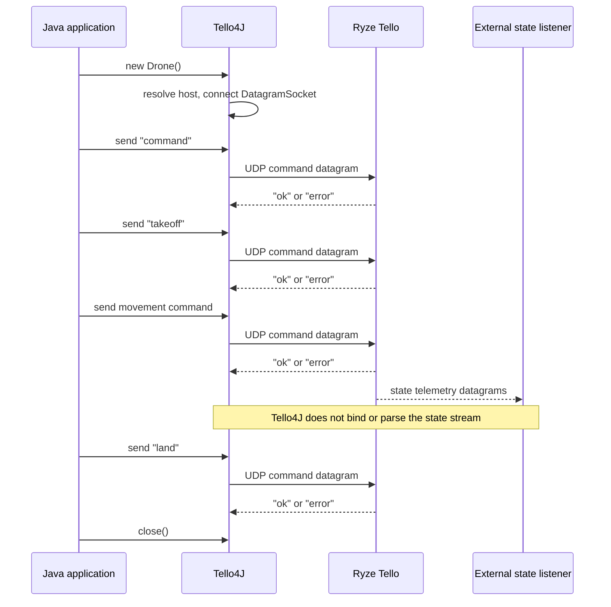
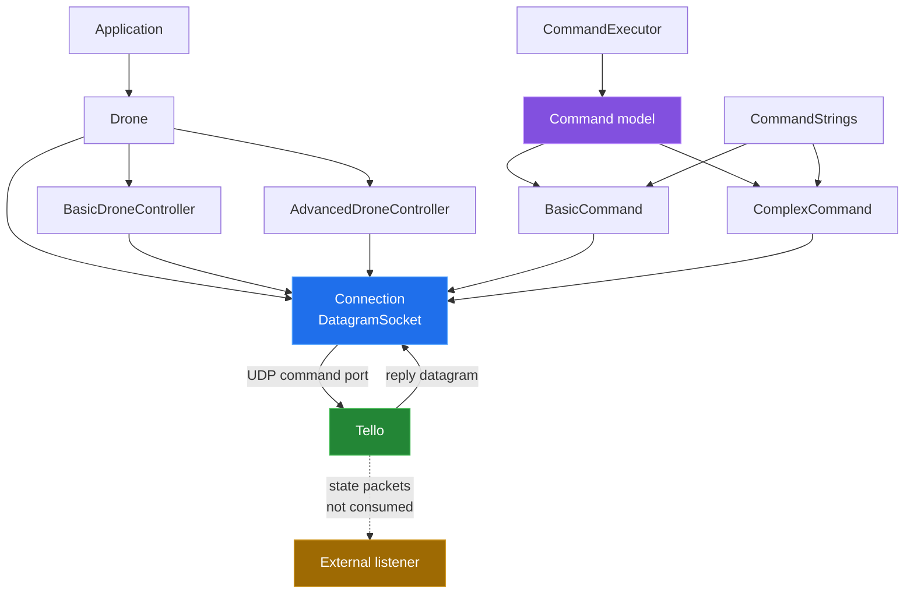

# Tello4J

Tello4J is a small Java wrapper around the Ryze Tello SDK's UDP command
protocol. It opens a datagram connection to the Tello's default command
endpoint, turns enum values and command objects into wire text, and exposes
helpers for sending commands and reading replies. It is useful as a thin
starting point for a Java flight program; it is not a complete flight-control,
telemetry, or video SDK.



## Quick start

Build the library from the repository root:

```sh
mvn -B -q clean package
```

The build command above was run successfully during this documentation pass.
To fly, put the built jar and its Log4j dependency on your application's
classpath, then use the smallest direct API path:

```java
import ch.bissbert.CommandStrings;
import ch.bissbert.connection.Drone;

import java.io.IOException;

public final class QuickStart {
    private static void requireOk(Drone drone, String command) throws IOException {
        if (!drone.sendCommandAndFetchStatus(command)) {
            throw new IOException("Tello rejected: " + command);
        }
    }

    public static void main(String[] args) throws IOException {
        try (Drone drone = new Drone()) {
            requireOk(drone, CommandStrings.COMMAND.getCommand());
            requireOk(drone, CommandStrings.TAKE_OFF.getCommand());
            requireOk(drone, CommandStrings.LAND.getCommand());
        }
    }
}
```

This flight example was not run: this environment has no Tello aircraft. The
class opens the endpoint hard-coded by `Drone`, sends `command`, then sends
takeoff and land. Test only with a charged aircraft, a clear area, and a
deliberate safety plan.

## Architecture



`Drone` is a convenience subclass of `Connection`. Its source constants point
to `192.168.10.1` on UDP port `8889`, the Tello command endpoint. Constructing
the object creates and connects a Java `DatagramSocket`; it does not send the
SDK-mode command automatically. `DroneController.enterSDKMode()` is the one
controller operation currently implemented.

The official [Tello SDK 2.0 User Guide][sdk] describes the separate state and
video UDP interfaces. Tello4J currently models neither listener, parser, nor
frame decoder.

The library sends bare UTF-8 command text. `sendCommandAndFetchStatus()` treats
only a case-insensitive `ok` reply as success; a read command returns the
received UTF-8 payload instead.

## Capabilities

| Area | Present | Boundary |
|---|---|---|
| Command transport | UDP datagrams and UTF-8 text | Fixed default endpoint in `Drone` |
| SDK mode | `command` via controller or direct send | No automatic handshake |
| Control commands | Enum values for takeoff, land, stream, emergency | Caller sequences and checks replies |
| Movement commands | Enum values and arbitrary command parameters | No range or arity validation |
| Read commands | `sendCommandAndFetchData()` and status helper | One blocking receive, no timeout |
| Telemetry | No listener or state model | Use a separate UDP listener |
| Video | `streamon` / `streamoff` wire strings | No video receiver or decoder |
| Command chain | `CommandExecutor` and `Reference<T>` types exist | Tail and parameter paths have known defects |

## Measured results

The commands and scripts behind these values are documented in
[`docs/measurement.md`](docs/measurement.md).

| Check | Result |
|---|---:|
| `mvn -B -q clean package` | exit `0` |
| Java sources under `src/main/java` | `14` files, `512` lines, `13,186` bytes |
| Build output | `16` class files; jar `15,856` bytes |
| `CommandStrings` entries parsed | `18` |
| Local UDP-stub probe | `13/13` checks passed |
| No-reply receive probe | still blocked after `5,004` ms in the captured run |
| Java compiler reported by inventory | `javac 21.0.2` |

The probe uses synthetic localhost replies such as `ok`, `error`, and
`stub-reply`. It does not measure flight, radio range, telemetry, battery,
latency to an aircraft, or video.

## Repository layout

```text
src/main/java/ch/bissbert/
├── CommandStrings.java          wire command vocabulary
├── command/model/               command objects and composition
├── command/creator/             command execution and references
└── connection/                  UDP transport, drone, controllers
docs/                            subsystem write-ups and measurement method
tools/                           source inventory, table generator, local probe
```

Start with [`docs/README.md`](docs/README.md) for the write-ups. The command
table in [`docs/protocol.md`](docs/protocol.md) is emitted by
`python3 tools/command_table.py` from `CommandStrings.java`.

## Known limitations

- The repository has no telemetry listener, telemetry parser, video receiver,
  or frame decoder.
- `Connection.fetchDataByte()` blocks on `DatagramSocket.receive()` and never
  configures a socket timeout. A missing reply can therefore park the caller.
  A finite timeout would be a public behavior change — the default value and
  the caller contract for `SocketTimeoutException` both have to be chosen — so
  none was introduced.
- A failed `Connection` setup is printed and then followed by `connect()`, so
  an invalid host or socket setup can fail again through a null field. Fixing
  this needs an API decision — whether an initialization failure should surface
  as a checked or an unchecked exception — so the constructor is unchanged.
- `Drone` has no constructor for a custom host or port. Tests and alternate
  Tello network layouts must use `Connection` directly.
- No flight program was run against a real aircraft in this pass. The diagrams
  are protocol documentation, not a flight recording.

Three further defects recorded during this pass have since been fixed on the
default branch: `ComplexCommand.parameters` was never initialized, so
`addParam()` failed before a complex command could be composed;
`CommandExecutor.run()` called `after.run()` even for a final command with no
successor; and a send after `close()` reached the socket instead of taking the
library's `NoConnectionException` path. Each command now gets its own parameter
list, a terminal executor skips the missing successor, and `sendCommand()`
requires a socket that is both connected and not closed. See
[`docs/BUGS-FOUND.md`](docs/BUGS-FOUND.md).

[sdk]: https://dl-cdn.ryzerobotics.com/downloads/Tello/Tello%20SDK%202.0%20User%20Guide.pdf
