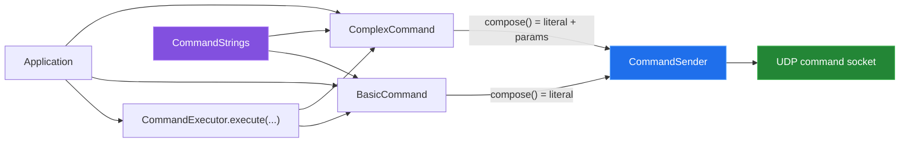
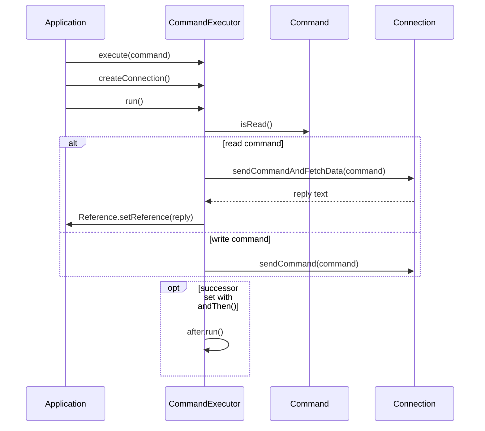

[← back to the overview](../README.md)

# Command model and execution

The command layer separates command text from the socket that sends it. The
source is under [`command/model`](../src/main/java/ch/bissbert/command/model/)
and [`command/creator`](../src/main/java/ch/bissbert/command/creator/).

## Composition path

`AbstractCommand` stores the wire text and a boolean read flag. `BasicCommand`
returns that text unchanged. `ComplexCommand` appends its parameters
with spaces: after `addParam(20)`, a `forward` command composes to
`forward 20`. Each command has its own parameter list (fixed in `42c9dff`;
see [Bugs found](BUGS-FOUND.md)). `addParam(null)` logs a warning and adds
nothing.

## `CommandExecutor`

`CommandExecutor.execute(CommandStrings)` and
`CommandExecutor.execute(String)` each create a basic executor. Calling
`withParam()` replaces that path with a complex executor and adds the first
parameter. `withReadAndSaveIn(Reference<String>)` marks the command as a read
and stores the eventual reply in the supplied reference.

The intended run path is:

`andThen()` stores one successor. The last executor in a chain has none and
stops after its own send or read (fixed in `35081a4`). `run()` does not create
a connection: without `createConnection()` it throws `NullPointerException`.
All executor instances share one static connection.
For predictable behavior, the direct `Connection` API is easier to audit.

## Class responsibilities

| Type | Responsibility |
|---|---|
| `Command` | Compose wire text and expose the read flag |
| `AbstractCommand` | Store command text and read state |
| `BasicCommand` | Return one literal command |
| `ComplexCommand` | Append object parameters to a command |
| `CommandExecutor` | Send commands and optionally save a read reply |
| `Reference<T>` | Mutable holder for a saved reply |

The command model does not validate that a command accepts a parameter, that a
parameter has the right type, or that a value is safe for a real aircraft.
