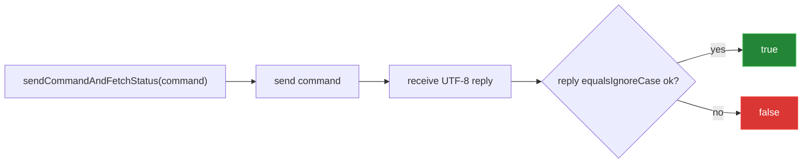

[← back to the overview](../README.md)

# Connection and transport

The connection layer is a thin wrapper over `java.net.DatagramSocket`. The
main source files are [`Connection.java`](../src/main/java/ch/bissbert/connection/Connection.java),
[`Drone.java`](../src/main/java/ch/bissbert/connection/Drone.java),
[`CommandSender.java`](../src/main/java/ch/bissbert/connection/CommandSender.java),
and [`DroneController.java`](../src/main/java/ch/bissbert/connection/controller/DroneController.java).

## Lifecycle and failure paths

```mermaid
stateDiagram-v2
    [*] --> Constructing
    Constructing --> Connected: resolve host, create socket, connect
    Constructing --> SetupFailure: lookup or socket setup throws
    SetupFailure --> [*]: throws UncheckedIOException with the cause
    Connected --> Connected: send command datagram
    Connected --> Waiting: receive reply
    Waiting --> Connected: reply datagram arrives
    Waiting --> Connected: timeout expires; SocketTimeoutException
    Connected --> Closed: close()
    Closed --> Closed: later send throws NoConnectionException
```



This is an implementation state model, not a state machine maintained by the
library. There is no public `ConnectionState` value. If the host does not
resolve or the socket cannot be opened, the constructor throws
`UncheckedIOException` with the `UnknownHostException` or `SocketException` as
its cause (bug 5 in [Bugs found](BUGS-FOUND.md), fixed).

The constructor also sets the socket's receive timeout: 15 seconds
(`DEFAULT_RECEIVE_TIMEOUT_MS`) with `Connection(host, port)`, or the value
passed to `Connection(host, port, receiveTimeoutMs)`. `0` waits forever.
`setReceiveTimeout()` changes it later. A read that runs out of time throws
`SocketTimeoutException` and the connection stays usable. The command is not
sent again.

## What `Connection` puts on the wire

`sendCommand(String)` rejects a null string, encodes the text as UTF-8, creates
one `DatagramPacket`, and sends it to the address and port captured by the
constructor. It does not add a newline, length prefix, retry, or sequence
number. `sendCommand(Command)` calls `compose()` first.

`fetchDataByte()` allocates a receive buffer and calls `socket.receive()`. The
default helper in `CommandSender` asks for a buffer of `1024` bytes. The actual
datagram length is used when copying the result, so the returned byte array is
trimmed to the received payload. `fetchDataString()` decodes that payload as
UTF-8 without trimming it.

The status helper is intentionally small:



Any reply other than `ok` maps to `false`; the original reply text is not
returned by this helper. A read operation should use
`sendCommandAndFetchData()` instead.

## The `Drone` convenience type

[`Drone.java`](../src/main/java/ch/bissbert/connection/Drone.java) fixes the
host to `192.168.10.1` and the command port to `8889`. Its constructor also
creates a `BasicDroneController` and an `AdvancedDroneController`. At present
both controller classes inherit the same one-operation base:

```java
public void enterSDKMode() throws IOException {
    connection.sendCommand("command");
}
```

Constructing `Drone` connects the local UDP socket, but it does not call
`enterSDKMode()`. The application must send `command` before other SDK
commands, as shown in the [protocol write-up](protocol.md).

The [Tello SDK 2.0 User Guide][sdk] documents the aircraft's command,
state-telemetry, and video interfaces. Tello4J implements only the command
side. It has no UDP server for state packets and no video receiver.

## Important boundaries

| Boundary | What the source does |
|---|---|
| Missing reply | `SocketTimeoutException` after the receive timeout, 15 s by default; no retry |
| Closed socket | `close()` closes the socket; a later send throws `NoConnectionException` |
| Failed command | Status helper returns `false` for any reply other than `ok` |
| Failed setup | Constructor throws `UncheckedIOException` with the original cause |
| Custom endpoint | Use `Connection(host, port)`; `Drone` has only its fixed defaults |
| Telemetry | Not bound, decoded, stored, or exposed |

[sdk]: https://dl-cdn.ryzerobotics.com/downloads/Tello/Tello%20SDK%202.0%20User%20Guide.pdf
