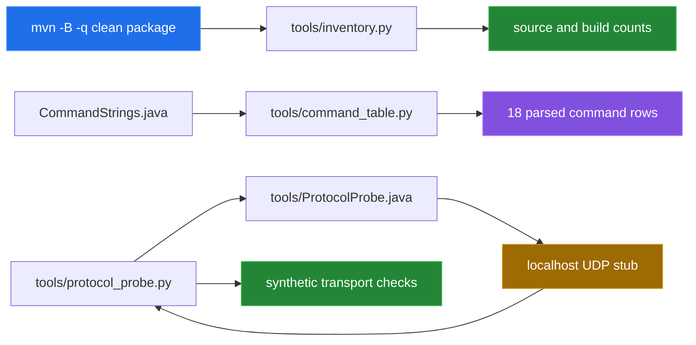

[← back to the overview](../README.md)

# How this was measured

Every number in the overview comes from one script run in a Linux container:

```sh
sh tools/linux-run.sh > media/captures/linux-run.txt
```

[`tools/linux-run.sh`](../tools/linux-run.sh) starts
`maven:3.9-eclipse-temurin-11`, mounts the repository read-only, copies it,
builds it with Maven, and runs the three scripts in [`tools/`](../tools). The
full output is [`media/captures/linux-run.txt`](../media/captures/linux-run.txt);
every value below is taken from it.

No Tello aircraft was used. The protocol probe talks to a UDP stub on
`127.0.0.1` that sends synthetic replies.

## Environment

| | |
|---|---|
| Kernel | Linux 6.5.11-linuxkit, aarch64 (Docker Desktop VM) |
| Image | `maven:3.9-eclipse-temurin-11` (`sha256:72b9e4bb…a5d3d7`) |
| Java | OpenJDK 11.0.32, Maven 3.9.16 |
| Python | 3.12.3 |
| Date | 2026-09-24 |

## Measurement flow



## Build

`mvn -B -q clean package` exits `0`.

## Inventory

`tools/inventory.py` walks `src/main/java/ch/bissbert/`, counts source lines and
bytes, then counts the class files and the jar:

| Value | Result |
|---|---:|
| Java source files | `14` |
| Source lines | `514` |
| Source bytes | `13,272` |
| `.class` files | `16` |
| `target/tello4j-1.0-SNAPSHOT.jar` | `15,749` bytes |
| `javac` | `11.0.32` |

## Command table

`tools/command_table.py` parses `18` enum constants from `CommandStrings.java`.
The table is copied into [`protocol.md`](protocol.md); rerunning the script
shows any drift between that table and the enum.

## Local protocol probe

`tools/protocol_probe.py` opens a UDP socket on `127.0.0.1`, compiles
[`ProtocolProbe.java`](../tools/ProtocolProbe.java) against the built classes,
and answers selected command strings with `ok`, `error` or `stub-reply`. It
reports each check as `PASS` when the library behaves as the check describes:

| Check | Observed |
|---|---|
| `Connection(host, port)` constructs and connects | built |
| `sendCommand()` emits the bare command as one datagram | sent `"command"` |
| `"ok"` reply maps to `sendCommandAndFetchStatus() == true` | `true` |
| any other reply maps to `false` | `false` |
| a read command returns the reply payload verbatim | `"stub-reply"`, length 10 |
| `BasicCommand("up").compose()` | `"up"` |
| `BasicCommand(CommandStrings.TAKE_OFF).compose()` | `"takeoff"` |
| `BasicCommand(CommandStrings.SET_WIFI).compose()` | `"wifi ssid"` |
| `ComplexCommand.addParam(20)`, then `compose()` | `"forward 20"` |
| `CommandExecutor.run()` without `createConnection()` | `NullPointerException` |
| `CommandExecutor.run()` at the end of a chain | sent the command and returned |
| `sendCommand()` after `close()` | `NoConnectionException` |
| `Connection("does-not-exist.invalid", …)` | `NullPointerException` ([bug 5](BUGS-FOUND.md)) |
| `fetchDataString()` with no reply | still blocked after `5,002` ms ([bug 3](BUGS-FOUND.md)) |

All `14/14` checks pass. The stub received `command`, `takeoff`,
`provoke-error`, `battery?`, `command` and `stay-silent`, in that order. The
5-second figure is only the probe's wait budget; it shows that no receive
timeout is set, not how long a real aircraft takes to reply.

## Not covered

- No Tello aircraft, battery, motors, Wi-Fi link, telemetry stream or video
  stream.
- No flight duration, movement accuracy, response latency or packet loss.
- The quick-start flight class was not run.
- The diagrams describe the source and the SDK flow; they are not recordings.
