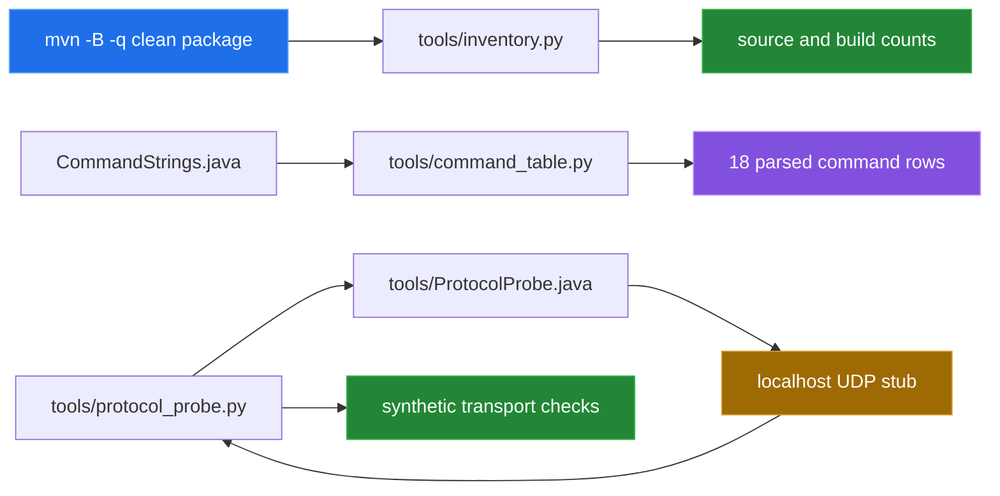

[← back to the overview](../README.md)

# How this was measured

Every measured number in the overview comes from a command run in this repository or
from a value printed by the source-driven scripts. The scripts are Python
standard-library programs; the protocol probe also compiles a small Java
driver against the already-built library.

No real drone run was possible here, so this pass ships diagrams only and no generated media.

## Measurement flow



## Commands run

### Build

```sh
mvn -B -q clean package
```

This completed with exit code `0`. It produced the Maven output inspected by
`tools/inventory.py`.

### Inventory

```sh
python3 tools/inventory.py
```

The script walks `src/main/java/ch/bissbert/`, counts UTF-8 source bytes and
newline-delimited lines, then counts `.class` files and jar bytes when
`target/classes` exists. Its captured output reported:

| Value | Captured result |
|---|---:|
| Java source files | `14` |
| Source lines | `512` |
| Source bytes | `13,186` |
| `.class` files | `16` |
| Built jar bytes | `15,856` |
| `javac` | `21.0.2` |

### Command table

```sh
python3 tools/command_table.py
```

The parser found `18` enum constants in `CommandStrings.java`. The resulting
table is copied into [`protocol.md`](protocol.md); rerunning the script is the
way to detect drift between that table and the enum.

### Local protocol probe

```sh
python3 tools/protocol_probe.py
```

This starts a UDP socket on `127.0.0.1`, compiles
[`ProtocolProbe.java`](../tools/ProtocolProbe.java), and returns synthetic
replies for selected command strings. It exercises construction, raw datagram
sends, status mapping, payload reads, command composition, executor failure
paths, post-close behavior, and the missing-reply behavior.

The captured run passed `13/13` checks. The no-reply thread was still blocked
after `5,004` ms. That is evidence about this local build and the source's
missing `SO_TIMEOUT`; it is not a measurement of aircraft latency or radio
reliability. The stub's `stub-reply` payload is synthetic and is never
presented as telemetry.

The probe's received datagrams were the source literals `command`, `takeoff`,
`provoke-error`, `battery?`, `command`, and `stay-silent`. No aircraft was
contacted.

## What was not measured

- No Tello aircraft, battery, motors, Wi-Fi link, telemetry stream, or video
  stream was available.
- No flight duration, movement accuracy, response latency, packet loss, or
  safety behavior is claimed.
- The quick-start flight class was not run.
- The diagrams describe source and SDK flow; they are not captured recordings.
