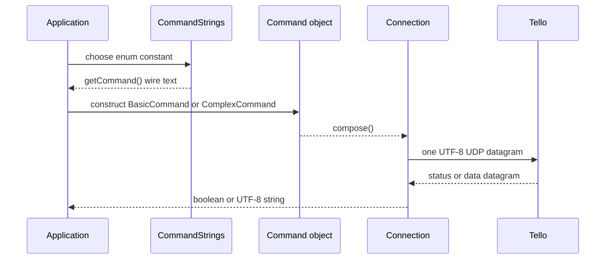
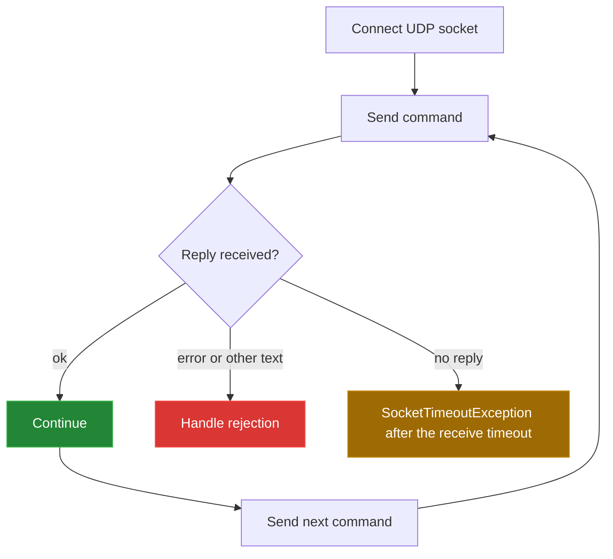

[← back to the overview](../README.md)

# SDK command vocabulary and wire protocol

[`CommandStrings.java`](../src/main/java/ch/bissbert/CommandStrings.java) is
the repository's command vocabulary. It stores the literal text sent to the
Tello and implements `CharSequence`; it does not encode command arguments,
validate ranges, or parse replies.

## Command path

The [Tello SDK 2.0 User Guide][sdk] describes the command endpoint and the
separate state and video streams. Tello4J implements only the command/reply
socket. `STREAM_ON` and `STREAM_OFF` are available as wire strings, but there
is no video consumer in this repository.

## Command table

The rows below are emitted by `python3 tools/command_table.py`. The constants
and wire text are parsed from the enum source. The role labels are a concise
reading aid; they are not validation rules.

| Constant | Wire text | Role | Source comment |
|---|---|---|---|
| `COMMAND` | `command` | enter SDK mode | |
| `TAKE_OFF` | `takeoff` | control | |
| `LAND` | `land` | control | |
| `STREAM_ON` | `streamon` | video control | |
| `STREAM_OFF` | `streamoff` | video control | |
| `EMERGENCY` | `emergency` | control | |
| `FLY_UP` | `up` | movement | |
| `FLY_DOWN` | `down` | movement | |
| `FLY_LEFT` | `left` | movement | |
| `FLY_RIGHT` | `right` | movement | |
| `FLY_FORWARD` | `forward` | movement | |
| `FLY_BACK` | `back` | movement | |
| `TURN_CLOCKWISE` | `cw` | movement | degree in 3600 instead of 360 |
| `TURN_COUNTERCLOCKWISE` | `ccw` | movement | degree in 3600 instead of 360 |
| `GO` | `go` | movement | |
| `SET_SPEED` | `speed` | set value | |
| `SET_WIFI` | `wifi ssid` | set value | |
| `GET_BATTERY` | `battery?` | read value | |

`ComplexCommand` appends caller-supplied values after the stored wire prefix,
separated by spaces. The source does not know the arity or range of those
values. `SET_WIFI` is therefore stored with the literal placeholder `ssid`,
and `GET_BATTERY` is a read command only when the caller marks it as read.

## Protocol obligations

The application owns the sequence:

Tello4J does not automatically send `command`, retry a rejected instruction,
or apply a safety interlock. After a missing reply it throws
`SocketTimeoutException` and leaves the next step to the caller. A flight program must
make those decisions explicitly.

[sdk]: https://dl-cdn.ryzerobotics.com/downloads/Tello/Tello%20SDK%202.0%20User%20Guide.pdf
